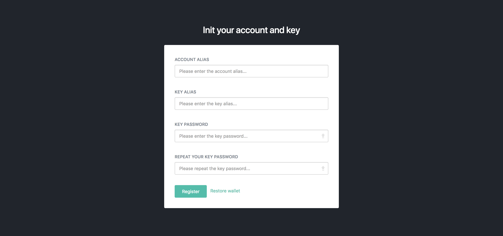
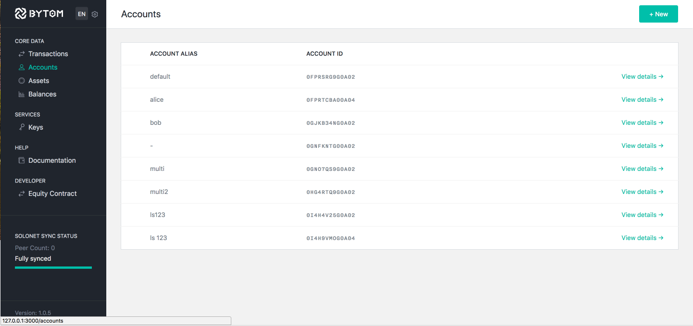
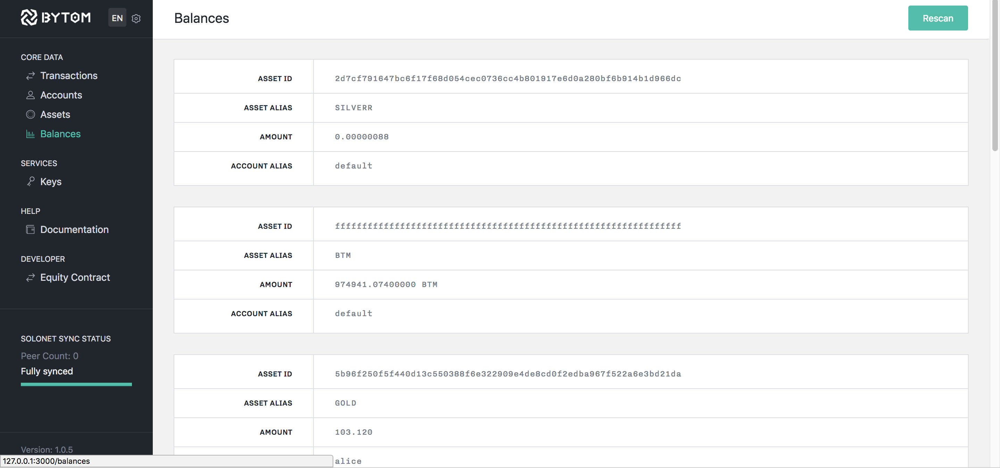
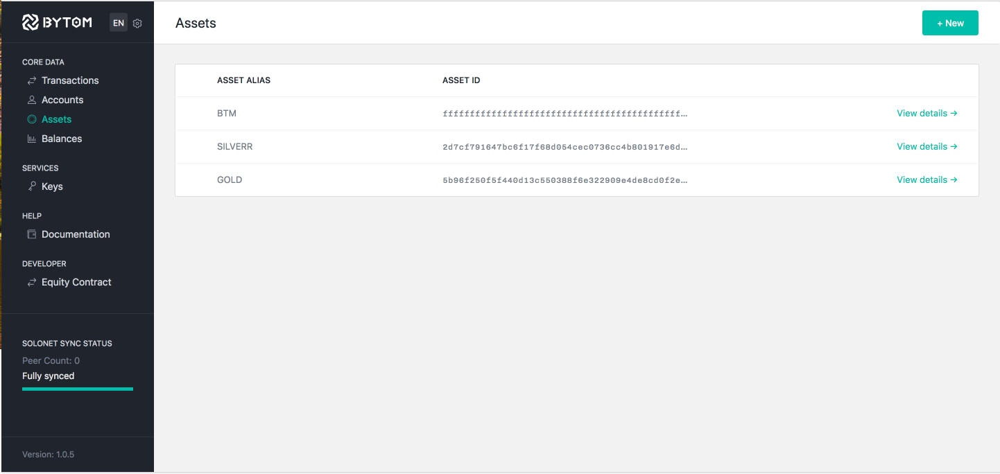
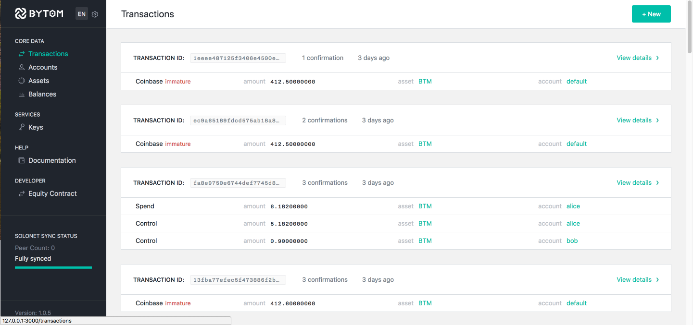
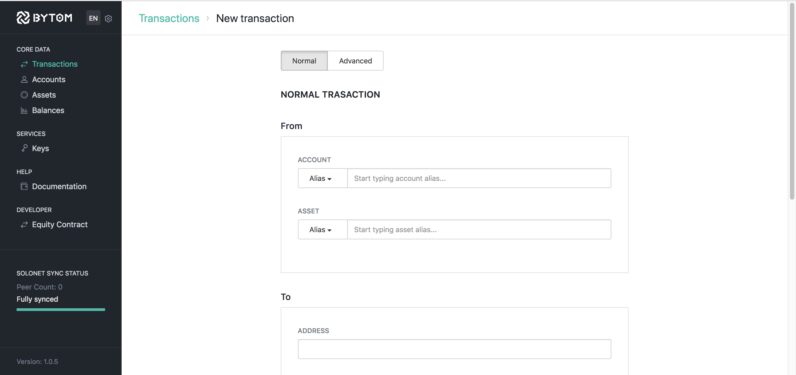
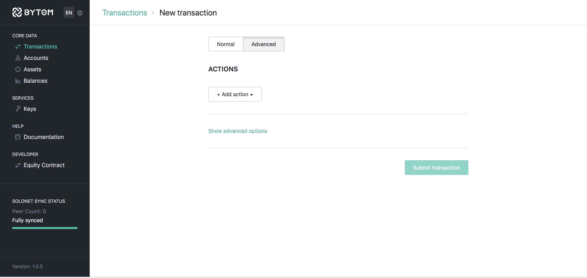
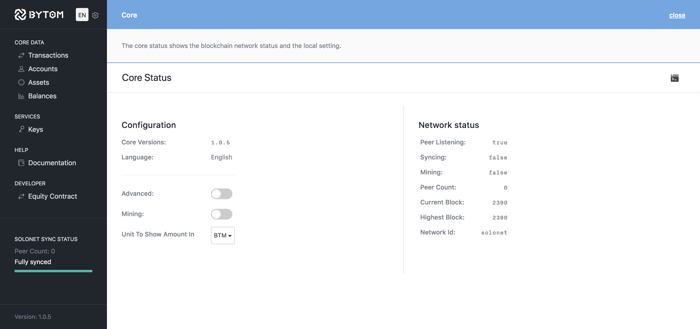

## Bytom dashboard的使用

```no-highlight
浏览器中输入打开 localhost://127.0.0.1:9888
```

## 首次使用Bytom的配置

首次打开使用全节点钱包会出现下面的页面



输入账户别名， 密钥， 密钥密码来配置钱包的默认账户。

---

## 账户

账户页面列举了钱包所有的可用账户， 和添加账户的功能。 
新建一个账户需要提供相应的别名，密钥。 账户会根据提供的密钥和别名信息自动生成相应的账户ID，和关联公钥。
每个账户可以拥有一个或者多个密钥与之相对应。




---

## 余额

余额页面向用户展示账户下拥有的资产类型和资产数目。



---


## 密钥

这个页面展示一个钱包所拥有的多把密钥。一个密钥对应相关的密码。
当账户进行交易时会需要输入账户相关的密钥密码。


---

## 资产

资产是 Bytom 的重要特性。 一个资产需要至少一把密钥对应。 资产信息会存于链上。



---

## 交易

交易页面展示所有钱包相关的交易内容展示。
交易ID 可以用于
[blockchain explorer](https://blockmeta.com/)来查看交易相关的记录信息.




点击界面右边的箭头按键查看详细的交易信息. 

---

## 新建交易

在这个页面，你可以发送相应数额的资产至其他地址。选择相应的账户，资产和数额， 将接收者的账户地址复制至地址框就可以创建一笔交易。相应的手续费会展示出来 




高级交易的页面允许构建一笔交易，让你从不同的账户发送不同的资产至不同的地址。



---

## 内核状态

这个页面提供了改变BTM单位，开启关闭挖矿和高级模式的功能。




---
